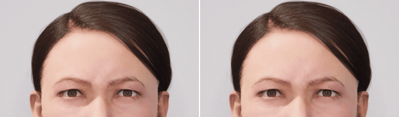
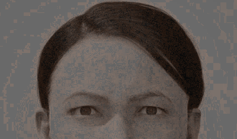

# Does the upper face follow the voice?

Code, the frozen pre-registration, and every derived measurement behind a study of whether
emotional talking-head models move the upper face with the speaker's voice — and whether adding
a voice-following brow layer changes what viewers perceive.

The seven files checked by `verify_freeze.py` are byte-identical to the versions hashed
before the first participant, and are shipped verbatim — including their working-note phrasing,
the paths of the machine they were written on, the original filenames they refer to, and, in the
plan and in one module name, the venue the work was prepared for. Any edit, even to a comment,
would break the hash that is the point of shipping them. Everything outside that set has its
machine paths written as `${PROJECT_ROOT}` and, for the corpora, `${CORPUS_ROOT}`.

---

## What the study did

1. **A voice-dose ladder.** Twelve recordings in three languages, each resynthesised with TD-PSOLA
   in cue-specific steps — pitch span, register, loudness range, rate, and a combined "effort"
   step copied from the average strong-vs-normal change of real actors. `c100` is resynthesis with
   no change and is the null for every step.
2. **An audit of four emotional talking heads** plus two constructed followers (one copies
   loudness to the brows, one copies pitch). The followers are the positive control: they make the
   ladder's ability to detect following measurable, so a flat model response means something.
3. **A same-actor human reference** — what a real face does between the normal and strong take of
   the same sentence, measured from video with MediaPipe in inter-ocular-distance units.
4. **A pre-registered learned upper-face layer**, with five gates frozen by hash before training.
5. **A pre-registered perception experiment.** Viewers compared the shipped model output (E) with
   the same render carrying the actor's own brow motion (H), and with that motion time-reversed (R).

## What the manipulation looks like

Two renders of the same utterance, the same character, the same camera and the same audio. The
only difference is the brow channel: **E** is the talking-head model as shipped, **H** is that
same render with the actor's own brow motion added.



*Left: E, the model as shipped. Right: H, the same render carrying the actor's brow motion.*

The pixel difference between them shows where the edit lives. Both clips come from one rig, one
scene and one camera, so `|H - E|` is exactly what changed — and it is confined to the brows and
the upper lids:



*`|H - E|`, gamma-lifted over a desaturated frame, normalised once across all frames so the
brightness tracks how much the brows actually moved rather than flickering.*

**Both clips are silent, deliberately.** No audio is included anywhere in this repository. The
IEMOCAP and ESD licences do not permit redistribution; the RAVDESS (CC BY-NC-SA 4.0) and JVNV
(CC BY-SA 4.0) audio could be redistributed with attribution and share-alike, but it is left to
the source releases so that one rule covers every stimulus. The clips also use a tighter upper-face
crop than the study's own framing, and come from a cell that the follow-up study does not use, so
nothing here is a copy of live experimental material.

**Credit for `media/`.** The clips are silent renders of an EmoFace avatar driven by RAVDESS
actor 08's angry utterance (cell `rav08_ang`); H carries that actor's own brow motion, retargeted
onto the render. Source: RAVDESS (Livingstone & Russo, 2018), CC BY-NC-SA 4.0. These adapted
frames are offered under CC BY-NC-SA 4.0 — see `NOTICES.md`.

## Layout

```
prereg/     the analysis plan, its SHA-256 freeze record, and every logged deviation
code/
  ladder/       the TD-PSOLA ladder builder and the realised rung table
  audit/        model inference wrappers, the brow readout, the dose analysis
  human/        the same-actor human prediction
  perception/   the frozen analyser, the session builder, robustness and mixed-model checks
  figures/      the figure scripts: protocol diagram, dose response, perception figure
data/
  derived/      every measurement the analysis produced
  perception/   the de-identified perception responses and their per-screen scores (see below)
media/          the two silent demo clips and the difference frames shown above
MANIFEST.json   what each shipped file is for, and what was deliberately left out
```

## The pre-registration is checkable, not just claimed

`prereg/PLAN_FREEZE.sha256` records the SHA-256 of seven files, taken **before the first
participant**. All seven are in this repository and still hash to those values:

```
python verify_freeze.py
```

The paths inside the freeze records are from the machine they were made on, so a plain
`sha256sum -c` will not resolve them; `verify_freeze.py` matches by **content**, which is the
property that matters and which survives the renaming done here for readability. Its output prints
each hashed name beside the file it is now.

## Reproducing

See `RECONSTRUCT.md`. Short version: the derived tables in `data/` carry every audited measurement
and every plotted value, and need no licensed material; the perception results can be recomputed
from `data/perception/perception_scored.csv`. Regenerating the stimuli from scratch needs the
source corpora, which have their own licences and are not redistributed here.

The figures redraw from those tables and nothing else: `code/figures/make_figures.py OUTDIR` draws
the protocol diagram and the dose response, the latter from `data/derived/figure_dose_values.csv`,
and `code/figures/make_perception_figure.py --check-scored` draws the perception figure from
`data/derived/figure_perception_values.csv`, recomputing those values from the per-screen scores
first and stopping if they disagree.

## What is deliberately not here

| | why |
|---|---|
| corpus audio (IEMOCAP, ESD) | licence-gated; redistribution is not permitted |
| corpus audio (RAVDESS, JVNV) | CC BY-NC-SA 4.0 and CC BY-SA 4.0 permit redistribution with attribution and share-alike (RAVDESS non-commercial only), but the audio is left to the source releases; nothing here needs a copy |
| the manipulated ladder audio | derivatives of the above; `code/ladder/` regenerates them |
| rendered stimulus videos | contain corpus audio and a rendered character. The two silent, cropped demo clips above are the exception: no audio, a cell the follow-up study does not use, illustrative framing, credited in `NOTICES.md` |
| the models' output arrays | rig-layout animation curves; the scoring code is here instead, and regenerates them from the models |
| model checkpoints | third-party, each under its own licence |
| raw session records | carry platform participant IDs, session IDs and timestamps; the de-identified responses are in `data/perception/` |
| the label-versus-voice and timing probe code and results | a separate bench; only its model adapters are referenced by `code/audit/run_ext.py` |

`MANIFEST.json` carries the same list in machine-readable form.

## Perception responses

`data/perception/` holds the perception experiment's responses in de-identified form.

| file | what it is |
|---|---|
| `perception_responses.csv` | every recorded screen of the 42 analysed sessions (3,420 rows; practice screens and revised answers are included and flagged by `is_practice` and `revision`) |
| `perception_scored.csv` | the frozen analyser's score for every pair judgement (2,517 rows: 1,762 from Experiment 1 and 755 from the unreported second experiment, told apart by `exp`); the reported perception results are participant means of `score_H` on the Experiment 1 rows |
| `participants.json` | each participant code's listener group, row count and `in_primary` flag |

- **Sample.** The 42 sessions completed under the stopping rule. `in_primary = 1` marks the 39
  viewers who passed the catch trials, the primary sample. A session completed after the stop is
  not included (see `prereg/DEVIATIONS.md`).
- **Removed.** Recruitment-platform IDs and usernames, session IDs, IP-derived codes, every
  timestamp, age, gender and interface language. No e-mail address ever entered the response
  records.
- **Codes.** `P01`–`P42`, ordered by listener group (`cn`, `en`, `jp`, the entry link) and assigned
  at random within each group, so they do not reflect the order in which people took part.
- **Use.** `data/perception/` is licensed CC BY-NC 4.0 for non-commercial research. Do not attempt
  to identify any participant.

The frozen analyser in `code/perception/` reads the original per-session records
(`webapp/data/lilt_link/whole_response/*.csv` with their `*_infos.json`), which are not
distributed because they carry the identifiers listed above. `perception_scored.csv` is its
per-screen output for exactly these sessions, so its results can be checked without them.

## Licence

The code in `code/` is MIT (see `LICENSE`). The files in `data/perception/` are CC BY-NC 4.0, and
the demo clips in `media/` are CC BY-NC-SA 4.0. Third-party components, corpora and models keep
their own licences — see `NOTICES.md`.
